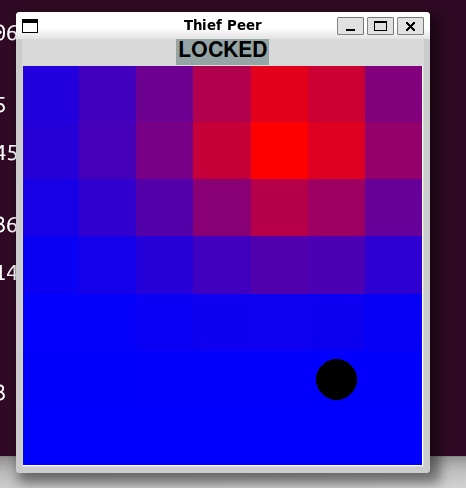
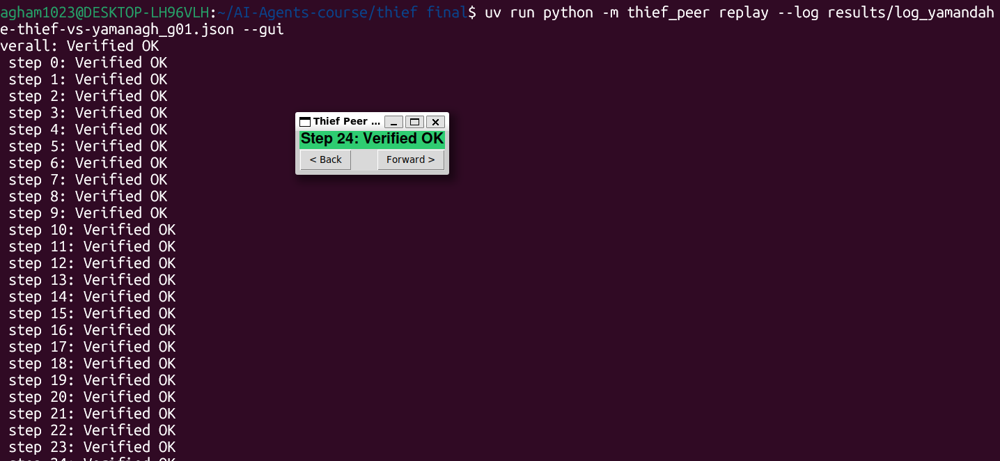

# Police-Thief P2P — Thief Peer

**Course:** Orchestration of AI Agents (Dr. Yoram Segal, University of Haifa)
**This repo's role:** THIEF peer — a fully independent, decentralized (P2P)
pursuit-game agent with no shared code or state with the Cop peer, per the
project's mandatory "full environment separation" rule.

## Companion (cop) repo

[Nagham1023/yamanagh-cop](https://github.com/Nagham1023/yamanagh-cop) — the
Cop role for this match (rule 49's four cross-links). `config/thief/game.toml`'s
`[repos]` block already declares this same URL as the negotiated pointer used
by the report bundle; this line is the human-readable copy the README itself
is required to carry.

## Project notebook

[Game-P2P-Thief-Chase Repository Chat](https://notebook.google.com/notebook/fd9ef012-acc0-449e-b644-b9785a4f8c18)
— a NotebookLM notebook loaded from this repo's docs, PRDs, and source
(grouped into algorithm/infrastructure bundles under `notebooklm_sources/`,
itself git-ignored — a convenience index for exploring the project, not a
graded submission artifact).

## Status

All 8 stages (`docs/PRD_1`…`docs/PRD_8`) plus Stage 9's Cop-repo interop
adapter (`docs/PRD_9_cop_interop.md`) are built and tested: 419 tests,
96%+ line coverage (`gui/*` excluded from the coverage gate per
`pyproject.toml`), ruff-clean. `peer/runtime.py`'s `PeerRuntime` is the real
live-match orchestrator — `cli.py run --group-name ... --config ...` drives
handshake → every round's commit/reveal → the end-of-match mutual audit →
a Gmail report, automatically. `tests/integration/test_live_match.py` proves
this with two real `PeerRuntime` instances, each with its own live FastMCP
server, playing a full match to completion over real localhost sockets.

**Known limitation.** This repo has no Cop-peer implementation (the Cop is a
separate, independently-built repo per the book's "zero shared code" rule),
so the live-match proof above is necessarily two Thief `PeerRuntime`
instances pointed at each other — real proof the protocol/orchestration
machinery works end to end, not a claim of having tested against actual Cop
gameplay logic. Playing a real match against the teammate's Cop repo is
listed below as a manual step.

## What this is

Two autonomous AI agents — a Cop and a Thief — chase each other on a
discrete grid with **no central server and no referee**. Each side is a
fully independent process, communicating only via FastMCP over the network,
using scent-trail-based partial observability (stigmergy) and a
Commit-Reveal/SHA-256 protocol so neither side can cheat without being
cryptographically caught. Full formal background, scoring, and the security
model: see `docs/PRD.md`.

## Docs

Start with `docs/PRD.md` (requirements) → `docs/PLAN.md` (architecture,
module layout, ADRs, API contracts) → `docs/TODO.md` (build order index).
The original plan had 7 build stages; two more were added after real-world
gaps surfaced post-shipment (Stage 8) and once the companion Cop repo became
available to interop against (Stages 9–10). Each stage has its own
`docs/PRD_<n>_<name>.md` (design) and `docs/TODO_<n>_<name>.md` (task
checklist):

1. Base logic (grid, movement, capture/survival rules)
2. FastMCP infrastructure (localhost)
3. Strategy module (the evasion algorithm — the graded differentiator)
4. Language + scent integration (belief map, LLM-generated hints)
5. Public URL + tunnel reachability
6. Commit-Reveal crypto sealing + Step-0 hardware declaration
7. Reporting shell (Gmail+OAuth, live GUI, replay simulator)
8. `PeerRuntime` + the live-match MCP tools (`docs/PRD_8_peer_runtime.md` —
   a gap found after Stage 7 shipped, not part of the original 7-stage plan)
9. Cop-repo interop adapter (`docs/PRD_9_cop_interop.md` — a unilateral
   translation layer against the independently-built Cop repo's own wire
   protocol; see "Cop repo interop status" below)
10. Cop-parity + cloud-readiness hardening (`docs/PRD_10_cop_parity_hardening.md`
    — independent verification of the Cop team's own "advanced extension"
    claims, plus a public-internet readiness audit)

## Running it

```
uv sync                                   # install dependencies
uv run pytest --cov=thief_peer            # full test suite + coverage gate (85%)
uv run ruff check .                       # lint
uv run python -m thief_peer smoke-test --config config/thief/game.toml
uv run python -m thief_peer run --group-name "Your-Team-Name" \
    --config config/thief/game.toml --shared-config config/thief/game.json
uv run python -m thief_peer run --group-name "Your-Team-Name" --gui \
    --config config/thief/game.toml --shared-config config/thief/game.json
uv run python -m thief_peer auth-gmail --credentials credentials.json
```

`auth-gmail` is the one-time OAuth2 bootstrap (`infra/gmail_auth.py`,
Appendix א §1.5) that produces `token.json` — run it once, before the first
real `run`, after you've created `credentials.json` yourself (see the
manual step below; that part genuinely can't be automated). It opens a
browser for the one-time consent screen, then exits; re-running it later
just silently refreshes an expiring token or no-ops if the existing one is
still valid.

`run` drives a full live match against `network.opponent_url` to completion.
Add `--gui` to watch it live in a Tkinter window (belief heatmap + turn
banner, `gui/live_session.py`) instead of running headless — the match runs
on a background thread while the window polls `PeerRuntime.view()`; closing
the window ends the session (the match itself keeps running to completion
regardless, same as headless mode). Add `--warmup` for a test/practice
match that should **not** count toward the per-opponent league counter
(rule 52 — uncounted warm-up games are permitted, but must never inflate
the persisted count a real match's report declares). `smoke-test` is a
lighter diagnostic (a single `ping` round-trip).

Real starter files ship at `config/thief/game.toml` (private) and
`config/thief/game.json` (shared, Appendix ו's default values). Before a
submission-relevant run, check `game.toml`'s two placeholder-ish fields:
`network.opponent_url` (the Cop peer's actual reachable MCP URL, currently
a localhost placeholder) and `email.recipient` (currently the user's own
address for early testing — change to the real grading recipient before a
real submission run). `game.json`'s values are this repo's own starting
proposal, not yet negotiated/hashed with the
Cop peer — see the "Cop repo interop" note below before assuming they're
final.

## Config split

Two files, merged by one `ConfigManager` (`shared/config.py`, ADR-5):

- **`game.json`** — shared, signed terms both peers must agree on byte-for-
  byte (grid size, move limits, etc.) — negotiated and hash-verified via the
  same `CommitReveal` primitive used for per-turn sealing (DRY, ADR-6).
- **`game.toml`** — private, local-only terms (network port, opponent URL,
  strategy/LLM class selectors, email recipient).

On a key collision the JSON value always wins — it's the signed, mutually-
agreed term; the private TOML must never be able to quietly weaken it.

## Strategy / LLM extension points

`strategy/brain_base.py`'s `resolve_brain(config)` loads a `BrainBase`
subclass via a dotted-path selector (`[strategy] thief_class =
"pkg.module:ClassName"` in `game.toml`), defaulting to the shipped
`ThiefBrain` (`strategy/fleeing_brain.py`). `BrainBase.decide()` structurally
never lets a strategy's *move* computation touch an LLM — only
`strategy/trash_talk.py`'s hint/verdict banter (Stage 4) calls an LLM
provider, and only through `talk_providers.py`'s pluggable adapters
(template / ollama / claude_api / claude_cli), themselves only reachable
through `shared/gatekeeper.py`'s rate-limited `ApiGatekeeper` (ADR-4).

---

# Academic README — six mandatory sections

Each section below traces its claims to a real module, PRD, or test in this
repo — no invented numbers. Where a fact is time-sensitive (a match result,
a status flag), the current, honest one is given, including the story of
what changed and why, per this project's own house discipline of recording
what was found wrong, not just what shipped.

## 1. The Chosen Dec-POMDP Model (מודל ה-Dec-POMDP הנבחר)

### Scientific description

This project models the pursuit as a two-agent, decentralized, partially
observable Markov decision process: `⟨I, S, {A_thief, A_cop}, T, {Ω}, O, R⟩`.
`I = {thief, cop}` — exactly two agents, each its own OS process, its own
repo, with **zero shared code or live state** (the project's mandatory
"full environment separation" rule; this repo contains only the Thief role).
Neither agent ever observes the true joint state `S`; each acts on its own
local, partial observation `Ω`, updated turn by turn via `O`, exactly the
Dec-POMDP formalism from Ch.9 of the course book rather than a single-agent
POMDP (there is no shared belief, no communication channel that reveals
ground truth, and no central referee resolving the joint state — integrity
instead comes from the Commit-Reveal/SHA-256 protocol, see §2).

### Mathematical components

- **State space `S`** — both agents' true grid positions plus the declared
  barrier layout (`domain/board.py`), the round counter, and per-agent
  `TurnFsm` phase (`peer/turn_fsm.py`). The true joint state is never fully
  knowable to either side by construction: `gui/window.py`'s `PeerView`
  dataclass structurally has no opponent-position field (ADR-8, enforced at
  the type level, not by GUI-drawing convention), so the objective board can
  never leak into a render call or a strategy decision.
- **Observation space `Ω`** — two independent channels per turn:
  1. *Spatial (scent).* `domain/scent.py`'s 5×5 diffusion-and-decay kernel
     (book Fig. 4 exactly: center 0.90, orthogonal 0.62, diagonal 0.42,
     range-two orthogonal 0.20, range-two diagonal 0.14, corners 0.04),
     applied every turn via `τij(t+1) = max(0, (1−ρ)·τij(t) + Δτij)`. This is
     the *only* ground-truth-adjacent signal, and it is unfakeable — the
     opponent cannot lie about where they physically walked.
  2. *Verbal (hint/verdict).* A free natural-language message the opponent
     may compose (`strategy/trash_talk.py` + `talk_providers.py`) — never
     coordinates, never guaranteed true. This channel is a claim to be
     weighed against the scent evidence, never trusted on its own.
- **Transitions `T`** — `domain/rules.py`'s movement/capture/survival rules:
  legal orthogonal moves, barrier collision, and the two terminal
  conditions (capture on same-cell, survival past the step ceiling).
- **Observation function `O`** — `domain/belief.py`'s `BeliefGrid`: a
  Bayesian update against the scent reading plus per-turn diffusion (to
  account for the fact that the opponent moved since the last observation),
  producing a full probability distribution over the opponent's position,
  never a single point estimate.
- **Nature of spatial uncertainty** — strictly probabilistic and
  monotonically decaying without fresh evidence (the scent field's own
  `ρ` decay term); the strategy in `strategy/fleeing_brain.py` and
  `strategy/adaptive_thief_brain.py` acts on the *full distribution*
  (belief-weighted expected distance), never a `most_likely()`-only
  shortcut, since collapsing to a point estimate would throw away exactly
  the uncertainty the Dec-POMDP formalism is meant to capture.
- **Nature of verbal uncertainty** — adversarial, not stochastic: the
  opponent's hint/verdict is generated by a strategic agent (possibly an
  LLM) that may deliberately bias it toward deception (see §3). The belief
  update therefore never folds a hint directly into the probability
  distribution as if it were sensor noise — it is tested against the
  scent-derived belief instead (a hint that flatly contradicts strong scent
  evidence is weighted down, not blindly trusted).

## 2. FastMCP Orchestration Dilemmas (דילמות התזמור של FastMCP)

### P2P coordination trade-offs

Running two independently-built, mutually-distrusting peers over FastMCP —
with no central broker, each peer simultaneously a server and a client
(`docs/PRD_2_mcp_infra.md`) — surfaced concrete engineering dilemmas no
single-process design would ever hit:

- **Payload shape.** Every MCP tool in `infra/mcp_server.py` wraps its
  argument as one `{"payload": {...}}` object rather than loose keyword
  arguments — the two independently-built peers had to agree on a single
  wire convention up front, since there is no shared schema-generation step
  between two separate codebases.
- **Real vs. mocked latency.** A genuinely unreachable `Client` connection
  took several seconds of internal retry before failing — far slower than a
  mocked transport in a unit test — so deadlines tuned against mocks were
  too tight against the real network. `infra/mcp_client.py` now
  distinguishes `DeadlineExceededError` (our own budget ran out) from
  `TransportError` (the connection itself failed) specifically because of
  this gap between test and reality.
- **Real production incident (round 26/27, `docs/todoFIXMCP.md`).** A live,
  cross-machine league match against a real opponent hit repeated
  connection failures mid-series, root-caused (via ngrok's own
  `/api/tunnels` metrics API) to request-rate-triggered degradation on
  ngrok's free tier (p99 latency over 50 seconds after only ~230
  connections on a freshly-restarted tunnel) — not a wear-over-hours issue
  as first suspected. This forced two real fixes: unsafe retry-on-any-
  exception logic that could double-increment round state non-idempotently
  was narrowed to only retry genuinely retryable failures, and the whole
  public-facing side of every subsequent match was migrated from ngrok to
  Cloudflare Quick Tunnels (`cloudflared tunnel --url ...`), a decision
  confirmed by real health-probe testing, not guesswork.

### Robustness & roles

Three modules divide the orchestration responsibility, deliberately kept
separate rather than folded into one god-object (referencing the course
book's Ch.2 orchestration patterns and Ch.8 turn-taking model):

- **Orchestrator — `peer/runtime.py`'s `PeerRuntime`.** The single live-match
  driver: wires handshake → per-round commit/reveal exchange → end-of-match
  mutual audit → Gmail report, end to end. `cli.py run` does nothing but
  construct and hand off to this object. Proven end-to-end in
  `tests/integration/test_live_match.py` with two real `PeerRuntime`
  instances, each with its own live FastMCP server, playing a full match to
  completion over real localhost sockets — not mocked.
- **Gatekeeper — `shared/gatekeeper.py`'s `ApiGatekeeper` (ADR-4).** The
  single doorway every outbound Gmail or LLM call must pass through, never
  called directly from `infra/email_sender.py` or `infra/llm_provider.py`.
  It chains a `DosDetector` (a circuit breaker that hard-locks on anomalous
  call volume, protecting the account *before* the provider notices, not
  after), a `TokenBucket` (lazily refilled,
  `tokens ← min(C, tokens + r·Δt)`), and a bounded `RequestQueue` (overflow
  requests queue rather than silently drop), with retry/backoff on 429s and
  every attempt logged regardless of outcome.
- **Watchdog — `shared/watchdog.py` + `peer/strategy_deadline.py`.** Two
  distinct supervisory layers, deliberately not merged: a per-request
  Deadline Tracker (`strategy_deadline.py`, bounds one strategy-compute step
  or one round's wait) versus a whole-system heartbeat/freeze detector
  (`watchdog.py`, catches the process itself hanging, not just one slow
  call) — `docs/PRD_5_cloud_tunnel.md`'s rationale for keeping these
  separate: a hung local decision must never be confused with a genuinely
  dead peer process.

Turn transitions are governed by an explicit `TurnFsm` (`peer/turn_fsm.py`,
the literal book turn-FSM transition table from Ch.8 p.63) that rejects
illegal transitions rather than silently absorbing them — deadlock
prevention by construction. Real bugs found and fixed after initial
shipment (`docs/PRD_8_peer_runtime.md` addenda) under this same
hostile-network lens: the mutual audit was originally one-directional only
(fixed to be symmetric); barrier-capture detection had zero call sites
wired in (fixed); `python -m thief_peer` never actually worked because
`main.py` should have been `__main__.py` (found only when a human ran the
documented command); the watchdog's heartbeat producer was never wired into
the live match loop (fixed).

## 3. Implemented Strategies (האסטרטגיות שמומשו)

### Decision brain

`strategy/brain_base.py`'s `resolve_brain(config)` loads a `BrainBase`
subclass via a dotted-path selector in `game.toml`, defaulting to the
shipped `ThiefBrain` (`strategy/fleeing_brain.py`). A structural rule
(ADR-1) keeps the LLM out of the actual move decision entirely — only the
verbal hint/verdict layer ever calls one.

### Heuristics & search (Manhattan distance / shortest paths / minimax)

`ThiefBrain` is a hand-tuned weighted-sum policy over the full belief
distribution, not a single-point heuristic:

- **Expected distance** (weight 1.0) — Manhattan distance from each
  candidate move to every cell in the belief grid, weighted by that cell's
  belief probability, not just the single most-likely opponent position.
- **1-ply mobility** (weight 1.5) — the number of legal moves available
  from the candidate cell, the signal that actually keeps the Thief out of
  dead-end pockets; tuned empirically against a constructed corner-trap
  board where distance-only scoring walked straight into a dead end.
- **1-ply minimax lookahead** (weight 0.1) — a shallow search: for each
  candidate move, evaluate the Cop's best response from its most-likely
  believed position, and discount moves that let the Cop close the gap
  fastest under that one-step adversarial model.
- **Least-recently-visited tie-break** — avoids predictable back-and-forth
  trails between otherwise-equal-scoring moves.

The Stage-7 **`AdaptiveThiefBrain`** (`strategy/adaptive_thief_brain.py`,
`docs/PLAN.md` §7, added after real league losses exposed a Cop-side
belief-staleness exploit and a Thief-side scoring-weight bug) extends this
with pessimistic lookahead, per-opponent style profiling
(`strategy/opponent_profile.py`), and softmax-sampled move selection instead
of always taking the single top-scoring move — still pure heuristic/search,
not reinforcement learning (see §4).

### Verbal deception — prompt engineering and hint decoding

`strategy/trash_talk.py` composes the hint/verdict message; `talk_providers.py`
supplies four pluggable LLM backends (`template` — zero-token, book-default,
zero latency; `ollama`; `claude_api`; `claude_cli`), selected via
`[trash_talk] provider` in the private `game.toml`, throttled by
`every_n_steps`, and hard-falling-back to the template provider on any LLM
error or timeout — the strategy layer can never be blocked or crashed by an
unreliable LLM call. All LLM calls route through the Gatekeeper (§2), never
directly. A hard word-cap is enforced in code, not left to prompting alone,
since an LLM cannot be trusted to self-limit its own output.

The **deceptive verdict bias** is the actual bluffing logic: whether to tell
the truth or lie about the opponent's own guess is decided by reusing the
same `_expected_distance` belief-quality signal the movement brain already
computes — lie more often when the Thief's own belief about the Cop is
already accurate (there's less to lose by misdirecting), tell the truth more
when the belief is already far off (a lie adds little value and risks a
credibility cost against an opponent tracking consistency across turns). A
known, documented limitation: `observe_scent()`'s cumulative-snapshot
reweighting degrades belief tracking after roughly 3 turns on long trails —
an open item, not silently hidden.

## 4. Learning Curves (עקומות למידה)

**No reinforcement learning was trained for this repo's Thief strategy.**
`docs/PRD_3_strategy.md` §4 evaluates the book's three sanctioned strategy
tracks — (1) pure heuristics, (2) a custom algorithm, (3) Q-Learning — and
explicitly documents the decision to build track 2 (the heuristic +
1-ply-minimax hybrid described in §3 above) instead of track 3: *"RL
requires a training loop, an epsilon-greedy exploration schedule, and a
Q-table... real engineering cost for a book-acknowledged non-requirement."*
The rejection is recorded as deliberate and reversible, not as a gap — the
Bellman update `Q(s,a) ← Q(s,a) + α[r + γ·max_a' Q(s',a') − Q(s,a)]` and an
epsilon-greedy action-selection scheme are documented in that same PRD as a
drop-in `BrainBase` subclass this repo *could* add later via the existing
`resolve_brain()` extension point, without changing any other module.

No training run, Q-table, or learning curve exists anywhere in this repo's
history — the only quantitative evidence available is real match outcomes
(the league record in §"League play" below) and unit/integration-test
coverage, not RL convergence data. (A separate, unrelated course exercise —
an HW6 Q-Table Advisor built while auditing a classmate's different combined
cop+thief assignment — trained tabular Q-learning over 10,000 self-play
episodes; that work belongs to that other repo, not to this Thief agent's
own decision logic, and is not a claim made here.)

## 5. Screenshotted Evidence — Absolute Requirement (צילומי מסך - חובה מוחלטת)

**Status: captured.** Both mandatory screenshots below were taken from a real
live session on a visible desktop, not mocked or staged.

**Live GUI — belief heatmap actively tracking the Cop:**



Captured from `uv run python -m thief_peer run --group-name "Your-Team-Name" --gui --config config/thief/game.toml --shared-config config/thief/game.json` — the Tkinter window (`gui/live_session.py` + `gui/window.py`) rendering `BeliefGrid`'s probability cloud (red = highest belief) with the scent model shown `LOCKED`, never the objective board (ADR-8).

**Replay App — Commit-Reveal audit, "Verified OK":**



Captured from `uv run python -m thief_peer replay --log results/log_yamandahle-thief-vs-yamanagh_g01.json --gui` — the terminal shows every step (0 through 24+) plus the match `overall: Verified OK`, and the GUI (`gui/replay_view.py`) shows the same **green "Verified OK"** stamp per step, confirming the Commit-Reveal audit engine found no tampering in the recorded log.

## 6. Link to the Companion Repository (קישור למאגר הנלווה)

**[Nagham1023/yamanagh-cop](https://github.com/Nagham1023/yamanagh-cop)**

## Documented contradictions (Academic Freedom clause)

Two real disagreements between the book's descriptive text and its own
mandatory code tables were found during development and resolved per the
book's own "Academic Freedom in Case of Contradiction" clause:

**`TECHNICAL_LOSS` reachability.** Ch.8.3's descriptive text ("every state
has an emergency exit") and its own mandatory `GamePhaseMachine` code table
disagree: the code table only maps `TECHNICAL_LOSS` as a legal destination
from `COMPUTING_MOVE` and `AWAITING_REVEAL`, not from every state. This
repo's `TurnFsm` (`peer/turn_fsm.py`) implements the narrower, code-table
reading — because those are the only two states representing an active wait
on a pending peer response; `WAITING_FOR_OPPONENT`/`VERIFYING` don't, so
they'd have nothing to time out on. The independently-built Cop repo's own
state machine reached the same reading.

**`technical_loss` in the `result` report field.** The book's reference
`result` schema (Appendix ו) documents `result` as exactly one of
`capture | survival | timeout | tamper_forfeit` — no slot for this repo's
own `technical_loss` end reason (an illegal FSM transition, a
strategy-compute timeout, or a lockstep-wait timeout; never a proven rules
violation). This repo maps `technical_loss` → `"timeout"`
(`peer/match_end.py`'s `_RESULT_VALUE`): every technical-loss path here is
itself a deadline/protocol-timing failure, so `"timeout"` is the closest
honest fit in the book's own enum — `"tamper_forfeit"` is reserved for when
the mutual audit (rules 19/36) actually catches a hash mismatch, a distinct
and stronger claim this repo only makes when that audit genuinely fires.

## Cop repo interop status

As of Stage 9, the Cop repo is through its own PRD 10 (CLI + full report
bundle) — fully built. A tool-by-tool comparison against her actual cloned
source found a completely disjoint MCP surface (different tool names,
payload shapes, scent transport, Step-0 shape) — expected, since the book
never mandates one, and confirmed by her own `WIRE-CONTRACT.md`. Rather than
wait for a joint reconciliation, `src/thief_peer/interop/` builds a
translation adapter unilaterally, on this side only (see
`docs/PRD_9_cop_interop.md`): `network.opponent_protocol = "cop_v1"` in
`game.toml` switches `PeerRuntime` to speak her exact vocabulary.

Three concrete pieces verified **byte-for-byte identical against her actual
cloned code** (not just internal self-consistency): the ch.4.5 scent-lock
hash, a Step-0 declaration signature, and the scent wire round-trip.
Negotiation, Step-0, and the full commit/reveal/scent turn loop are
genuinely wired both directions (outbound calls + inbound tool
registration on this repo's own server). One real gap, deliberate and
documented: her per-turn `Hcommit` is cryptographically over a different
field set than this repo's own sealing, so her end-of-match audit can't be
made to pass against genuinely honest play without rebuilding this side's
sealing scheme to match hers exactly — `finalize_match` skips that
exchange in `cop_v1` mode rather than crashing on it.

**Before a real connection attempt:** `config/thief/game.json` must be made
byte-identical (not just schema-identical) to her actual shared config
file — her `config_sha256` check hashes raw file bytes — and the two teams
need to agree out-of-band on which side sets `initiate_step0`/dials in
first, same as her own `game.toml` already documents on her side.

## Going live: a real match over the public internet (rule 10)

`infra/server_lifecycle.py`/`infra/mcp_server.py::build_server` already bind
`0.0.0.0` by default, so a tunnel pointed at this process reaches it with no
code changes. This repo deliberately does not automate launching the tunnel
itself (`docs/PRD_5_cloud_tunnel.md` §4's own reasoning, revisited and kept
in `docs/PRD_10_cop_parity_hardening.md` §6) — the steps below are the
manual runbook that replaces that automation:

1. **Install and run a tunnel tool** (ngrok, Localtonet, or similar) pointed
   at `network.my_port` in your config, e.g. `ngrok http 8801`.
2. **Copy the template**: `cp config/thief/game_cop_remote.toml.example
   config/thief/game_cop_remote.toml`, then fill in the two `REQUIRED`
   placeholders — `network.opponent_url` (the tunnel URL *the other side*
   gives you, not your own) and `email.recipient`.
3. **Confirm `config/thief/game.json` is byte-identical** to the Cop side's
   copy before connecting (rule 11, [FATAL] if it isn't) —
   `sha256sum config/thief/game.json` on both machines must print the same
   hash. This repo's own handshake now checks this automatically
   (`domain/negotiation.py::Negotiation`, PRD_10) and will reject the
   connection with a clear error if the files differ, but confirming by
   hand first saves a wasted connection attempt.
4. **Confirm `token.json` exists** (`uv run python -m thief_peer auth-gmail`
   if it doesn't yet) — and if you're building a submission archive by
   zipping the working directory rather than `git archive`ing a tagged
   commit, deliberately exclude `token.json`/`credentials.json` from it.
   Both are already `.gitignore`d, but a raw directory zip doesn't respect
   `.gitignore`.
5. **Run the match**: `uv run python -m thief_peer run --config
   config/thief/game_cop_remote.toml --shared-config config/thief/game.json
   --group-name "Your-Team-Name"`.
6. **Verify afterward**: `uv run python -m thief_peer replay --log
   results/log_<game_uid>.json` prints a step-by-step and overall
   `Verified OK`/`TAMPERED` verdict (rule 20) — add `--gui` for the visual
   step-navigable window.

## League play: real matches against 5 opponent teams

This repo's `interop/std_v1/` adapter is what actually played real, countable
matches against other teams' independently-built repos over the public
internet. Five counted matches were completed and filed; one further
opponent was attempted and paused without a countable result — listed below
for completeness, not omitted.

### Match record (counted)

| Date (Israel local) | Opponent | Score (yamanagh) | Score (opponent) | Result |
|---|---|---|---|---|
| 2026-08-19, 21:16–21:19 | moamteam | 30 | 90 | Loss |
| 2026-08-19→20, 21:42–00:45 | yanell11 | 30 | 90 | Loss* |
| 2026-08-21, 20:09–20:12 | s82kma9e | 90 | 30 | Win |
| 2026-08-22, 19:59–20:03 | ali-ahm1 | 75 | 35 | Win |
| 2026-08-22→23, 23:59–00:03 | najamjad | 30 | 90 | Loss** |

\*yanell11 is filed as counted, but `mutual_agreement.confirmed` is `false`
in our own `result_yamanagh-vs-yanell11.json` — the peer's `series_consensus`
envelope never actually arrived over the wire, even though both sides'
independently-computed digests are byte-identical
(`35e4d731e92b49a7153a815757ea6bbb9993141772dcfb29e27e2f1daeb68b21`). A
known, unresolved wire-confirmation asymmetry predating this round of
interop fixes; the score itself was never in dispute.

\*\*najamjad's own build never transmits a `consensus_sha` on the wire at
all (confirmed both by their own admission and by grepping our own
debug-level server log across five separate matches against them — zero
`series_consensus`-shaped payloads ever received), so `mutual_agreement.
confirmed` stays honestly `false` here too, by design, forever, until they
ship their own fix. Filed as counted anyway via `std_v1.
trust_documented_consensus` — see item 9 below — after five consecutive
runs all produced the exact same byte-identical settlement hash
(`6fc49383e9412f7326a756d3518087635471cd6c3a53cafd88fa4bedf27bfc30`) and an
explicit written agreement with the opponent (email thread, 2026-08-22) to
treat that as sufficient in place of the live handshake.

Paused without a countable result: **SMNGRP05** (consensus never arrived at
all — not even an independently-matching digest — paused rather than
forced).

### What five real opponents surfaced, and how the adapter changed

Every item below came from an actual failure against an actual opponent's
independently-built implementation, not from re-reading the spec in
isolation — this is the real value of playing multiple teams instead of
one:

1. **Configurable starting role** (`std_v1.natural_role`, default
   `"thief"`) — `series_runner.py::play_series` used to hardcode
   `NATURAL_ROLE = "thief"`. najamjad is also unconditionally thief-first
   and refuses to swap; two thief-first sides talking past each other would
   silently play a meaningless series. Fixed by making the starting role a
   per-opponent config value instead of a module constant.

2. **Role-bound dual endpoints** (`network.opponent_url_when_police`,
   `series_runner.py::_transport_for_role`) — most opponents run one shared
   MCP door for both roles. najamjad runs two permanent, separately-hosted
   processes (`cop.4laboratory.com` / `thief.4laboratory.com`) with no
   shared door at all. Fixed by adding a second, optional transport,
   selected by which role we're currently playing.

3. **Numeric-string `sub_game_number`/`step`**
   (`exchange.py::_as_int_if_numeric`) — our lookup tables are keyed by
   `int`. At least one opponent's wire payloads carried these as JSON
   strings (`"1"`, not `1`), silently missing every int-keyed lookup. Fixed
   with a coercion helper applied at every storage/lookup site.

4. **A peer's own field-naming convention**
   (`exchange.py::_record_sub_game_number`) — najamjad's `submit_audit`
   payload nests the sub-game number as `payload.sub_game` (no `_number`
   suffix), not the `sub_game_number` convention our own kit and every other
   opponent so far used. Root-caused via new debug logging: the audit was
   arriving fine (`200 OK`, stored correctly) but `wait_for_audit`'s
   matching fallback only ever checked one field name. Fixed by generalizing
   the check to recognize both conventions.

5. **Debug-level MCP logging** (`network.mcp_log_level`,
   `infra/server_lifecycle.py::run_server_in_background`) — our access log
   only ever showed a bare `400 Bad Request` for a rejected call, never why.
   Added a config-driven log level so FastMCP's own session-manager
   rejection reason surfaces directly, used live while debugging najamjad's
   connection drops.

6. **ngrok → Cloudflare Tunnel migration** — najamjad reported intermittent
   "TLS-dead" connections; live health-probe testing against a real role
   flip ruled out their first theory (a role flip killing the tunnel). Root
   cause, confirmed via ngrok's own `/api/tunnels` metrics API: p99 latency
   over 50 seconds after only ~230 connections on a freshly-restarted
   tunnel — request-rate-triggered degradation on ngrok's free tier, not a
   wear-over-hours issue. Migrated the whole public-facing side of every
   match to Cloudflare Quick Tunnels (`cloudflared tunnel --url ...`)
   instead.

7. **Per-opponent terms override** (`std_v1.terms_path`) — ali-ahm1's very
   first handshake attempt failed rule 3
   (`peer's terms differ from ours`): their declared `setting` was
   `"Haifa"`, ours defaulted to `"New York"` (set for a different opponent).
   Rather than hardcode one setting for everyone, added a config-selectable
   terms file per opponent.

8. **Per-opponent counted-report recipients**
   (`email.cc_opponent_on_counted_report`) — different opponents declared
   different conventions for who gets CC'd on the final counted-match
   report (lecturer-only vs. lecturer + both teams). Made this a per-opponent
   config flag instead of one hardcoded policy, after ali-ahm1 explicitly
   asked for lecturer-only despite their own default proposal being
   CC-both.

9. **Per-opponent consensus-wait ceiling**
   (`network_and_league.consensus_ceiling_sec`,
   `interop/std_v1_opponent.py`) — the final consensus wait was hardcoded at
   400s for every opponent, no config hook at all. Against najamjad, whose
   build can structurally never send a valid consensus envelope (see item
   11), that 400s was pure dead time on every single run. Exposed as a
   per-opponent override (still 400s everywhere else, since another
   opponent's kit genuinely does send its envelope a few seconds late) and
   set to 30s for najamjad — cut the gap between the two sides' emailed
   reports from ~6.5 minutes to ~10 seconds.

10. **A peer's own validator rejecting a genuinely-absent value**
    (`interop/std_v1/identity.py::build_identity`) — `sysinfo.collect_spec()`
    honestly reports `gpu: None` when no GPU is detected; najamjad's own
    declaration validator required a string and rejected the `null`
    outright, blocking their declaration artifact for the whole series.
    Fixed by sending `"none"` (a string) for this one wire-facing field
    only — the shared detection code and the native/cop_v1 path that relies
    on real `None` semantics elsewhere are both untouched.

11. **A peer's build with no live confirmation channel at all**
    (`peer/runtime.py::run`, `std_v1.trust_documented_consensus`) —
    najamjad's own consensus envelope never carries a `consensus_sha` field
    (their own admission), so `mutual_agreement.confirmed` can never become
    `true` against them no matter how many times the underlying digest
    matches. Rather than silently rewrite the honest wire-level `confirmed`
    flag, added a narrow, opt-in, per-opponent override: an explicit written
    agreement that both sides' independently-emailed settlement hashes
    match stands in for the live confirmation for the *counted-vs-friendly*
    decision only, gated additionally on `results_agreed` (no
    tamper/disagreement signal) so it's not a blanket bypass of rules
    19/34/35's intent — just a narrower path to the same trust the live
    channel exists to establish, for the one opponent whose current build
    structurally can't produce it.

None of these were spec ambiguities resolved by reading the book more
carefully — each is a concrete interoperability mismatch between two
independently-built implementations, found by actually running a real match
and root-caused with real evidence (debug logs, tunnel metrics, byte-for-byte
digest comparisons) before being fixed.

## Manual steps this repo cannot perform for you

- **Creating `credentials.json` and completing the one-time browser consent.**
  `infra/gmail_auth.py`'s `ensure_token()` (via `cli.py auth-gmail`) is the
  real OAuth2 bootstrap logic and is fully tested against faked
  Credentials/Flow objects, but it still needs a real `credentials.json` —
  downloaded from a Google Cloud project with the Gmail API enabled and an
  OAuth client ID created (Desktop app type) — and a real human clicking
  through the actual consent screen in a real browser when `auth-gmail` runs.
  Neither can be produced or verified from here. A real sent-email
  verification (confirming a report actually lands in the inbox) is the
  same kind of manual check.
- **Playing a real match against the teammate's independently-built Cop
  repo** — `PeerRuntime` is built and proven against a second real instance
  of itself (see "Known limitation" above), but a genuine cross-repo match
  needs their process actually running, on their machine or a shared
  tunnel, which isn't something this repo can simulate or fake. See "Going
  live" above for the exact manual steps once both processes are ready.
